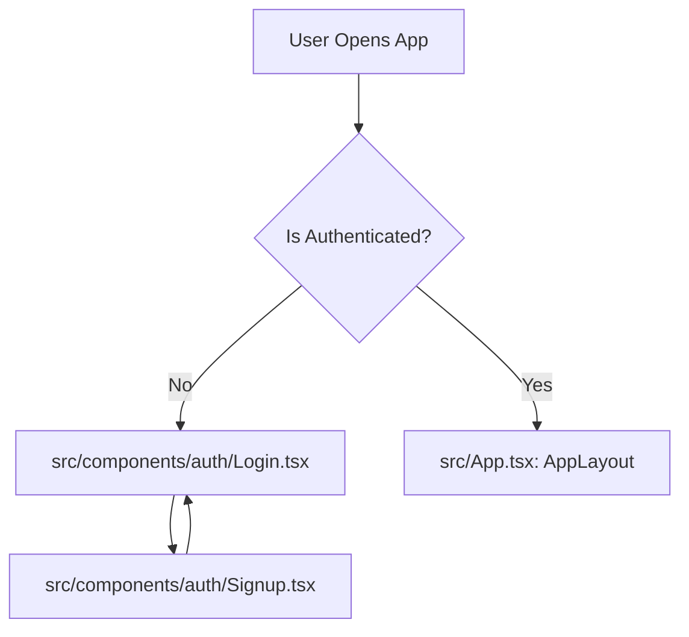

# Application Flow and Root Structure

This document outlines the entry point of the application and the navigation flow triggered by user interactions.

## 1. Root File and Entry Point

The application starts from the standard React-Vite entry points:

- **Root File**: `src/main.tsx`
  - Responsibility: Mounts the React application, provides the `AuthProvider` and global styles.
- **Main App Container**: `src/App.tsx`
  - Responsibility: Handles routing (`react-router-dom`) and conditional layout rendering based on authentication status.

## 2. Navigation Flow

The core application flow is managed by a central state (via Zustand) that tracks the `activeView`.

### A. Initial Load / Authentication


### B. Main Application Interaction (The "Click" Flow)
Once inside the application, the `Sidebar` is the primary driver of the view state.

```mermaid
graph LR
    Sidebar[Sidebar.tsx] -- "Click 'Dashboard'" --> SetDashboard[setActiveView('dashboard')]
    Sidebar -- "Click 'Kanban Board'" --> SetBoard[setActiveView('board')]
    Sidebar -- "Click 'Daily Logs'" --> SetLogs[setActiveView('logs')]
    Sidebar -- "Click 'Team Members'" --> SetMembers[setActiveView('members')]

    SetDashboard --> RenderDashboard[Render Dashboard.tsx]
    SetBoard --> RenderBoard[Render KanbanBoard.tsx]
    SetLogs --> RenderLogs[Render DailyLogs.tsx]
    SetMembers --> RenderMembers[Render Members.tsx]
```

## 3. Detailed Component Mapping

| Interaction | Action | Root File Responsible | Resulting Component |
| :--- | :--- | :--- | :--- |
| **App Start** | Mounts DOM | `src/main.tsx` | `<App />` |
| **Login** | Authenticates User | `src/App.tsx` | `<AppLayout />` |
| **Sidebar Click** | `setActiveView(view)` | `src/components/layout/Sidebar.tsx` | Updates `useStore` state |
| **View Swap** | `renderView()` | `src/App.tsx` (AppLayout) | Injects component into `<main>` |

## 4. Key Logic (src/App.tsx)
The actual component switching happens inside the `renderView` function in `AppLayout`:

```tsx
const renderView = () => {
  switch (activeView) {
    case 'dashboard': return <Dashboard />;
    case 'board':     return <KanbanBoard />;
    case 'logs':      return <DailyLogs />;
    case 'members':   return <Members />;
    default:          return <Dashboard />;
  }
};
```
