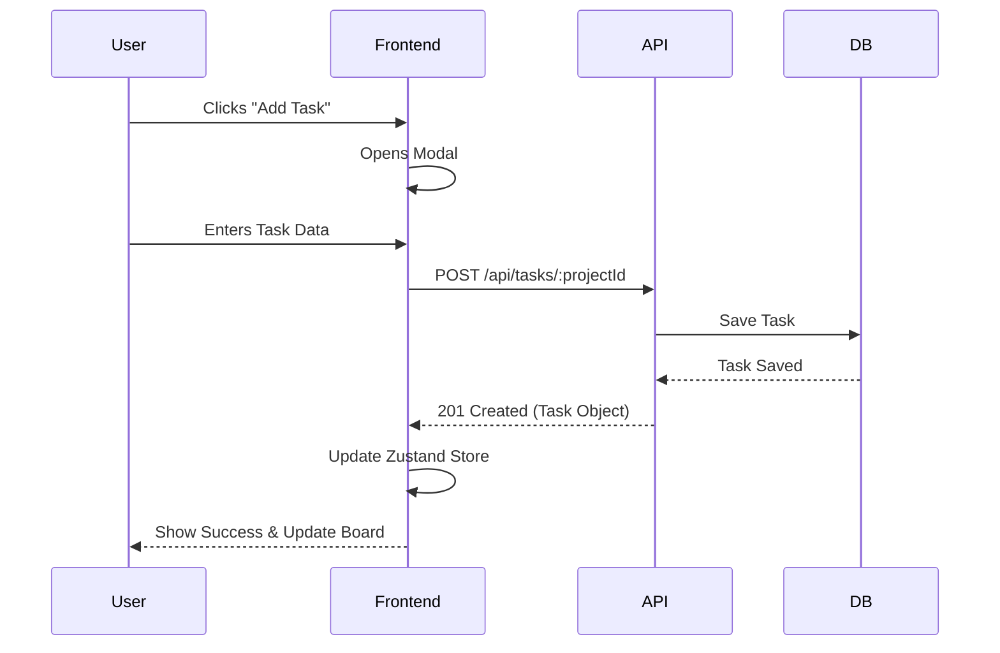

# End-to-End User Flow (E2E)

## 1. Onboarding Flow
1. **Signup**: New user registers with email and password.
2. **Dashboard Entry**: User is redirected to the main dashboard.
3. **Initial Setup**: User creates their first project or joins an existing one.

## 2. Project Management Flow
1. **Create Project**: User clicks "New Project" in the sidebar.
2. **Add Members**: Project Manager adds team members via the "Members" view.
3. **Set Goals**: User defines the project description and status.

## 3. Task Management Flow (Kanban)
1. **Create Task**: User adds a task in the "Board" view.
2. **Assign & Prioritize**: Task is assigned to a member and priority is set.
3. **Progress Update**: Member drags task from "Pending" to "In-Progress".
4. **Completion**: Once finished, task is moved to "Completed".

## 4. HR & Reporting Flow
1. **Daily Logs**: Members submit their daily progress logs.
2. **Capacity Check**: HR/Manager views the "Members" tab to check team bandwidth.
3. **Analytics**: Dashboard reflects real-time progress based on completed tasks.

## 5. System Interaction Flow

