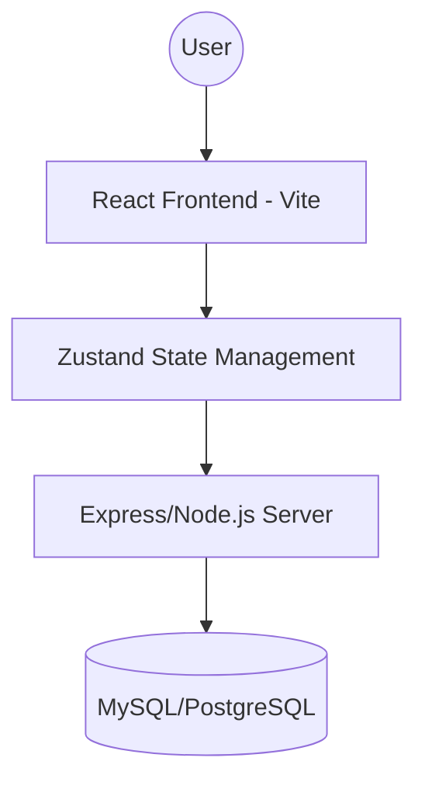

# High Level Design (HLD)

## 1. System Architecture
The application follows a classic Client-Server architecture with a decoupled frontend and backend.

### 1.1 Architecture Diagram

## 2. Technology Stack
- **Frontend**: React, TypeScript, Vite.
- **State Management**: Zustand.
- **Styling**: Vanilla CSS / Tailwind CSS.
- **Backend**: Node.js, Express (with some components potentially in FastAPI/Python).
- **Database**: MySQL (migrated from PostgreSQL).
- **Authentication**: JWT-based or Session-based.

## 3. Core Components
- **Frontend UI**: Responsive dashboard with Sidebar, Members, and Task components.
- **Backend API**: RESTful endpoints for CRUD operations on tasks, projects, and users.
- **Middleware**: Authentication and error handling layers.

## 4. Data Flow
1. User interacts with the UI.
2. Frontend triggers a Zustand action.
3. Zustand action calls a utility function (using Axios/Fetch) to hit the Backend API.
4. Backend API validates the request and interacts with the Database.
5. Response is sent back to the Frontend, updating the Zustand state.
6. React components re-render based on state changes.
